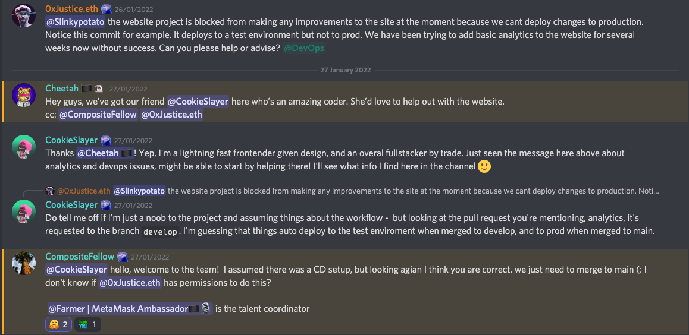
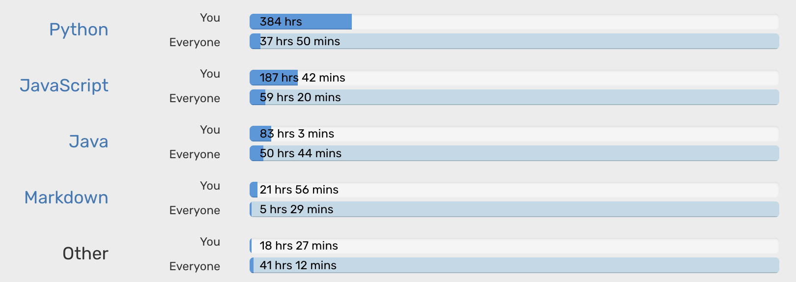

# README

Hey, I'm Evie, I love git. I git everything. Very little goes public, so Github is mostly my scratch pad for frontend work. I hangout a lot on Bitbucket for work.

As a programmer I'm more of a less-is-more chick. Like... I don't get bloating a new project with all the bells and whistles that'll need upkeep while trying to move forward fast. Most bang for the buck is my priority when early in an project.

Currently doing my own thing;

- [thesis](https://thesis.stenqvist.co) for my ML masters at KTH, subject to change as soon as I'm provided a supervisor.
    + Website wise I had a nice time working out a supercheap solution; Github Pages, Formspark (25$ for 50k submissions regardless of project or time horizon) and Integromat (lofty free tier) to get a POAP code on form submission from a google sheet. So - 25$ without any running costs.
    + I have an AWS Open Search instance running, and a lightweight EC2 instance with a python script that populates the Open Search with tweets regarding "DAO". Don't think this'll actually work out to anything, I just like hoarding data.

- product owner and fullstacker working on [School Health](https://www.admentum.se/elevhalsa/) used by many schools across Sweden.

- [Bitsk](https://bitsk.it) working towards a preincubation program (the website is secondary to the product ideation). I have a brilliant mentor. Very excited! Expecting lots of pivots.

This January (2022) I've built a couple of landing pages, because I can and I'm lightning fast 🤷‍♀️;

- [Sätra Brunn DAO](https://www.satrabrunn.xyz/), first time interacting with a contract! The progressbar pulls data from a [Juicebox contract](https://docs.juicebox.money/protocol/specifications/contracts/or-payment-terminals/jbethpaymentterminalstore).
- [Bankless Sweden](https://www.bankless.se/).

On my freetime I like opening up the [etherscan contract editor](https://etherscan.deth.net/) (append `address/[contract-address]`) to read contracts. Yet to try my hand at solidity development professionally. Also, I like dropping into discords and being helpful off the bat, like 10 minutes in

## 2021 Waka Stats - Time in editor

*Other is slightly misrepresented - there was an additional **100h** in the waka dropdown distributed across 20 different languages/formats*.

All those of you constantly labeling me "frontend first" (what, because I'm a she?!) TAKE THAT.

## Collab

<!-- "So, you've been a programmer for 10 years?" – for the longest time, I felt like a complete failure in the space. I did not have a fun time starting out at uni. I didn't realise that everyone was flailing. I didn't realise that my lightweight solutions were often as good as the over-engineered solutions I assumed were correct... I didn't understand that the biggest ego's, the ones making me feel useless, were the ones who knew the absolute least. -->

I shy away from OS work, but I *want* to do more open source and be less afraid of social interaction. I'm a clinical hermit - I dare say so because I believe that I, and others, can do brilliant work regardless of how we fit in to others arbitrary structures of being rockstars.

I planned on being an elusive shadow coder for the rest of my working days, but I realised that if I wanted to be apart of web3 I needed to interact. I've pre-doxxed myself.
